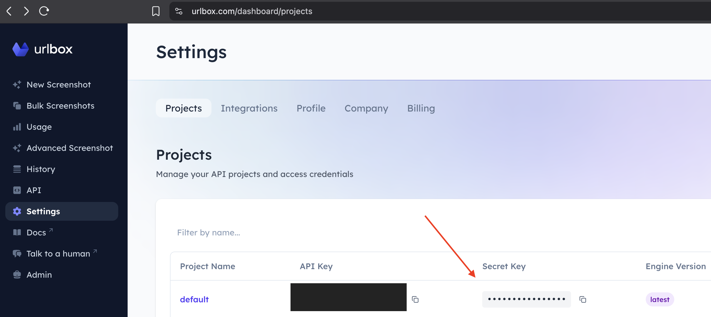

# n8n-nodes-urlbox

This is a n8n community node for the [Urlbox](https://urlbox.com) screenshot API. You can render screenshots, PDFs, Videos, and more of websites in your n8n workflows.

## Installation

Follow the [installation guide](https://docs.n8n.io/integrations/community-nodes/installation/) in the n8n community nodes documentation.

## Templates

The Urlbox node includes pre-configured templates:

- **Take Screenshot (PNG)** - Capture a standard PNG screenshot of the visible area of the page
- **Full Page Screenshot** - Capture the entire page as PNG
- **Mobile Full Page Screenshot** - Capture the entire page in mobile view as a PNG
- **Convert to PDF** - Convert the website to PDF
- **Smooth Scrolling Video** - Records the website as a full page MP4, scrolling smoothly down the page
- **Scrape HTML** - Capture the HTML of a page
- **Scrape Markdown** - Capture the Markdown of a page

## Additional Options

- **Clean Shot** - Toggle to remove ads, cookie banners, and auto-accept cookie prompts
- **Proxy URL** - Optional proxy URL we can use on your behalf to bypass regional blocking
- **Download As File** - Download the rendered output as a file instead of returning a URL (enabled by default)
- **Additional Options (JSON)** - Optionally Pass custom Urlbox API options as JSON to override or extend template defaults. Check out our [Docs](https://urlbox.com/docs) for more information.

## Credentials

You need an Urlbox API key to use this node.

1. Sign up for a [Urlbox account](https://urlbox.com/signup).
2. Navigate to your [projects page](https://urlbox.com/dashboard/projects).

3. In n8n, create new Urlbox API credentials and paste your "Secret Key" into the API key field.

For more information, refer to the [Urlbox authentication documentation](https://urlbox.com/docs/api#authentication).

## Compatibility

Compatible with n8n@1.60.0 or later

## Usage

### Basic Example

1. Add the Urlbox node to your workflow
2. Configure your Urlbox API credentials
3. Select a template (e.g., "Take Screenshot (PNG)")
4. Enter the URL you want to capture
5. Execute the node

The node returns a JSON response containing at a minimum:
- `renderUrl`: The URL of your generated screenshot/PDF/video
- `size`: File size in bytes

Or if you chose to download the file, it will return the raw image/video/other format.

